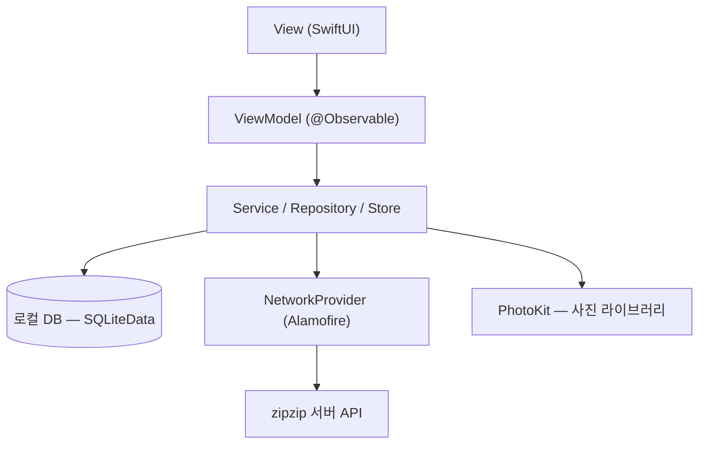
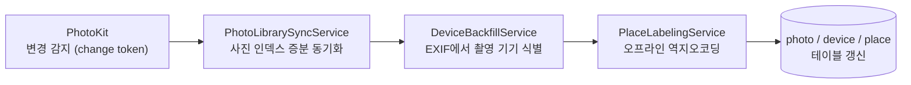
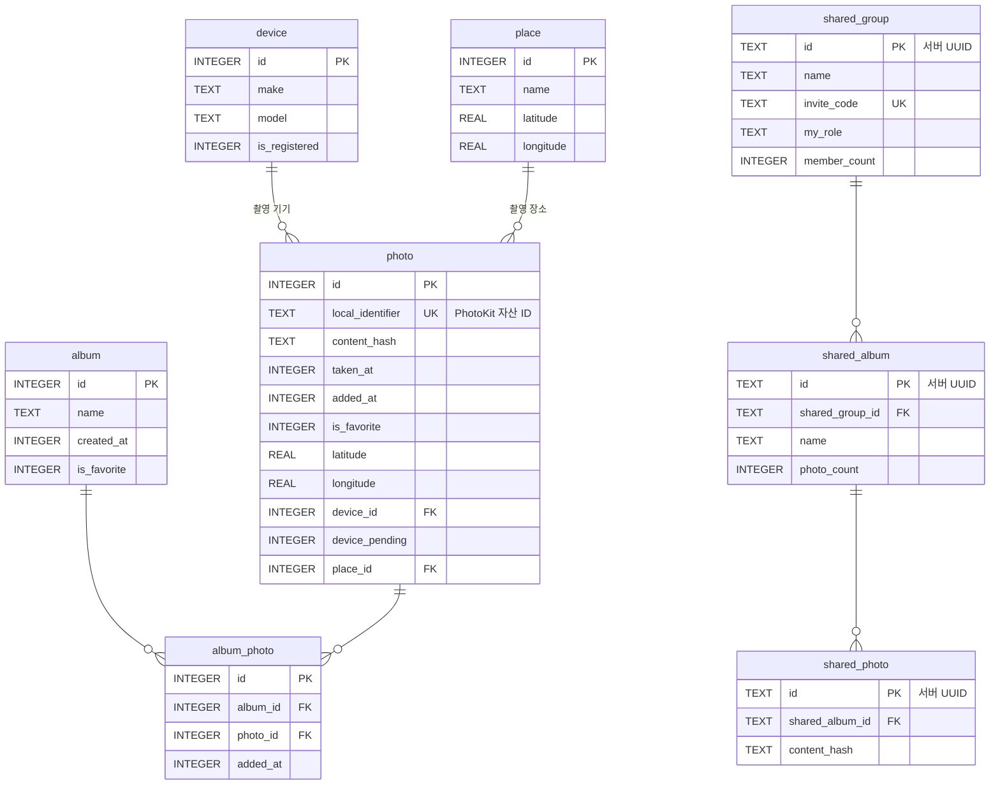
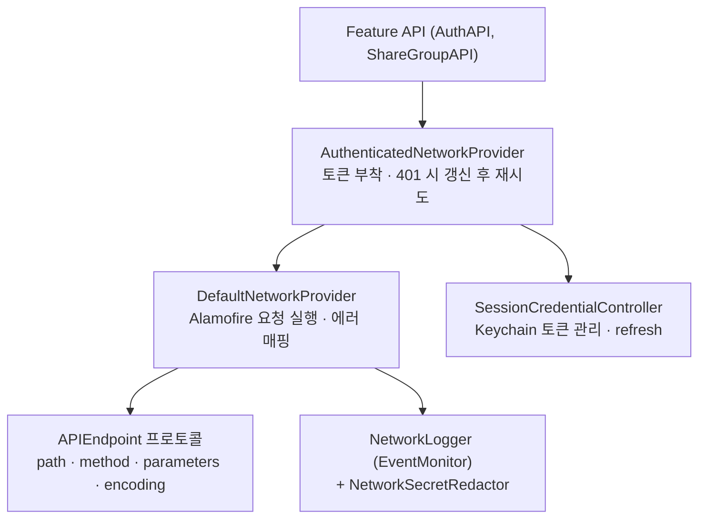

<h1>
   zipzip
</h1>

> 메인폰 밖에서 촬영된 사진을 더 쉽게 찾고, 분류하고, 다시 볼 수 있도록 돕는 사진 정리 보조 서비스

서브폰·카메라 등 여러 기기로 촬영한 사진이 한 라이브러리에 섞여 있으면 원하는 사진을 다시 찾기 어렵습니다. **zipzip**은 사용자의 사진 라이브러리를 분석해 **촬영 기기·날짜·장소 기준으로 사진을 자동 인덱싱**하고, 이를 바탕으로 필터링·앨범 정리·그룹 공유까지 이어지는 정리 경험을 제공하는 iOS 앱입니다.

## 📱 미리보기

| 메타데이터 수정 | 필터링 | 앨범 |
| :---: | :---: | :---: |
|  |  |  |

| 공유 | 공유 채팅 |
| :---: | :---: |
|  |  |

## ✨ 주요 기능

| 기능 | 설명 |
| --- | --- |
| **온보딩** | 서비스 소개 → 사진 권한 요청 → 라이브러리 스캔으로 촬영 기기 자동 감지 → 관리 대상 기기 선택 |
| **사진** | 전체 사진 그리드, 기기·날짜·장소·기타 조건 필터, 사진 메타데이터(촬영일시·위치) 조회 및 편집 |
| **앨범** | 개인 앨범 생성·정리, 즐겨찾기 앨범(기본 제공), 사진 이동/복사/삭제 |
| **공유** | Apple 로그인 후 공유 그룹 생성·초대 코드 참여, 그룹 내 공유 앨범으로 사진 공유 |
| **마이페이지** | 등록 기기 관리, 로그아웃·회원 탈퇴 |

### 설계 방향
- **로컬 우선(Local-first)**: 사진 원본과 메타데이터 인덱스는 기기 내 SQLite에 저장하고, 서버는 공유 기능에만 관여합니다. 개인 사진 정리는 네트워크 없이 완전히 동작합니다.
- **오프라인 역지오코딩**: 장소 라벨링에 네트워크 API(CLGeocoder) 대신 앱에 번들된 행정동/국가 GeoJSON을 이용한 point-in-polygon 판정을 사용해, 대량 사진 처리 시의 rate limit·네트워크 의존을 제거했습니다.
- **서버 데이터는 미러(캐시)**: 공유 그룹/앨범은 서버가 원본(source of truth)이며, 로컬 DB에는 조회 성능을 위한 미러 테이블만 둡니다.

## 🛠️ Library & Stack

### Language & UI


### Architecture


### Data & Photo


### Network & Auth


### Code Quality & Dependency (via SPM)


### Collaboration


### 기술 선정 이유

| 구분 | 기술 | 선정 이유 |
| --- | --- | --- |
| 언어 | Swift 5 | iOS 네이티브 개발 표준 언어 |
| UI | SwiftUI + Observation(`@Observable`) | 선언형 UI로 생산성 확보. Observation 매크로로 ObservableObject 대비 불필요한 뷰 갱신 최소화 |
| 로컬 DB | SQLiteData (SQLite) | STRICT 테이블·외래키·인덱스 등 SQL을 직접 제어하면서 타입 세이프한 Swift 모델 매핑 제공. 수만 장 규모 사진 인덱스 쿼리 성능을 위해 SwiftData 대신 채택 |
| 네트워킹 | Alamofire 5.12 | async/await 기반 요청 직렬화(`serializingDecodable`), Interceptor·EventMonitor 확장 지점 제공 |
| 사진 접근 | PhotoKit (PHPhotoLibrary) | 시스템 사진 라이브러리 접근 및 change token 기반 증분 변경 감지 |
| 인증 | Sign in with Apple + Keychain | 별도 회원가입 없는 낮은 진입장벽. 토큰은 Keychain에 암호화 저장 |
| 로깅 | OSLog | 시스템 통합 로깅, 카테고리별(네트워크·DB) 분리 |
| 코드 품질 | SwiftFormat(빌드 페이즈) + SwiftLint(SPM 플러그인) | 빌드 시 자동 포맷팅으로 팀 코드 스타일 강제 |
| 의존성 관리 | Swift Package Manager | Xcode 통합, 별도 도구 불필요 |
| 협업 | GitHub + Figma + Notion | 브랜치 전략(`main`/`dev`/`feat/#이슈`), 태그 기반 커밋 컨벤션 |

> **배포 타깃**: iOS 26, iPhone/iPad Universal

## 🏗️ 시스템 아키텍처

### 레이어 구조
MVVM을 기반으로, 데이터 접근을 Service/Repository/Store로 분리한 계층 구조입니다.



### 사진 동기화 파이프라인



- **증분 동기화**: PhotoKit의 change token을 `sync_state` 테이블에 저장해, 앱 재시작 시 전체 스캔 없이 변경분만 반영합니다.
- **기기 식별**: 사진 EXIF의 make/model을 읽어 `device` 테이블과 연결합니다. EXIF를 아직 읽지 못한 사진은 `device_pending` 플래그로 표시해 다음 동기화 때 재시도합니다.
- **장소 라벨링**: 번들된 행정동(국내)·국가(해외) GeoJSON에 대해 point-in-polygon 판정으로 장소명을 부여합니다. 네트워크를 사용하지 않아 대량 처리에도 안정적입니다.

## 📁 Foldering

```
zipzip-iOS/
├── App/                      # 앱 진입점 & 전역 구성
│   ├── zipzip_iOSApp.swift   # @main — DB 준비, DIContainer/Router 생성·주입
│   ├── RootView.swift        # NavigationStack + 라우팅 + 전역 시트/로그인 게이트
│   ├── RootTabView.swift     # 메인/사진/앨범/공유 탭 셸
│   ├── AuthenticationState.swift
│   └── Navigation/           # Route(화면 enum) + Router(push/pop/replace)
│
├── Core/                     # 앱 전반 인프라
│   ├── Database/             # AppDatabase(마이그레이션) + Schema/(테이블 레코드) + Store
│   ├── Network/              # Provider, Endpoint, Config, Error, Logger, Redactor
│   ├── Authentication/       # AuthAPI, Keychain 저장소, 세션 자격증명 관리
│   ├── PhotoLibrary/         # 사진 동기화·EXIF·역지오코딩·썸네일 로딩
│   ├── DI/                   # DIContainer
│   └── Extensions/           # 타이포그래피 등 공용 확장
│
├── Features/                 # 화면 단위 모듈 (View / ViewModel / Model / Service)
│   ├── Onboarding/  ├── Main/  ├── Picture/
│   ├── Album/       ├── Share/ └── MyPage/
│
├── Shared/                   # 공용 UI 컴포넌트 (Navbar, BottomSheet, Button, ...)
└── Resources/                # 에셋, Pretendard 폰트, GeoJSON, 기기 카탈로그
```

## 🗄️ DB 설계

### 개요
- **엔진**: SQLite (SQLiteData 라이브러리, STRICT 테이블, 외래키 활성화)
- **모델 매핑**: 테이블마다 `@Table` 매크로 기반 레코드 구조체(`PhotoRecord` 등)로 타입 세이프하게 매핑
- **마이그레이션**: `DatabaseMigrator`에 단계별 마이그레이션을 등록해 스키마 변경 이력 관리. 마이그레이션 실패 시 기존 스토어를 백업 후 재생성하는 복구 로직 포함

### ERD



## 🌐 네트워크 설계

### 레이어 구조



| 구성 요소 | 역할 |
| --- | --- |
| `APIEndpoint` | 엔드포인트 명세 프로토콜. 각 기능이 enum으로 path/method/parameters를 선언하면 `asURLRequest()`가 요청으로 변환 |
| `NetworkProvider` | `request<T: Decodable>(_:) async throws -> T` 단일 메서드 프로토콜. 호출부는 구현체를 모른 채 사용 |
| `DefaultNetworkProvider` | Alamofire 기반 구현. 상태코드 검증, 응답 디코딩, `NetworkError` 매핑 담당 |
| `AuthenticatedNetworkProvider` | 데코레이터 패턴. 요청에 Bearer 토큰을 부착하고 401 응답 시 토큰 갱신 후 1회 재시도. 갱신 불가 시 로그아웃 처리 콜백 호출 |
| `NetworkLogger` | EventMonitor로 요청/응답 전 구간 로깅. `NetworkSecretRedactor`가 토큰 등 민감정보를 마스킹 |

## 📣 Convention

### Branch
`태그/#이슈번호`
```
main ─────────────── 운영 배포본 (직접 push 금지)
dev ──────────── 통합 브랜치 / 스프린트 단위 관리
  └── feat/#1  개인 기능 개발 브랜치 (이슈 ID 기반)
hotfix/#2 ──── 긴급 버그 수정 (main에서 분기)
```

### Tag
| 태그 | 설명 | 예시 |
| --- | --- | --- |
| feat | 새로운 기능 추가 | `feat: 로그인 기능 추가` |
| fix | 버그 수정  | `fix: 로그인 예외 처리 버그 수정` |
| docs | README 등의 문서 수정 | `docs: API 명세 업데이트` |
| design | UI/UX 구현 | `design: 랜딩 뷰 구현` |
| refactor | 기능 변경 없이 코드 내부 구조 리팩토링 | `refactor: 로그인 처리 로직 리팩토링` |
| test | 단위 테스트 추가, 통합 테스트 추가, 테스트 코드 수정 | `test: 사용자 인증 로직 테스트 케이스 추가` |
| chore | 라이브러리 버전 수정, 패키지 관리 등 | `chore: 의존성 버전 업데이트` |
| comment | 주석 추가 / 수정 | `comment: 불필요한 주석 제거` |
| hotfix | 배포된 버전에서의 급한 버그 수정 | `hotfix: 서버 Timezone 설정 변경` |
| rename | 파일, 클래스 등의 이름 변경 | `rename: UserController → AuthController 변경` |
| remove | 파일, 클래스 등의 삭제 | `remove: 사용하지 않는 DTO 제거` |
| cicd | CI/CD 관련 설정 | `cicd: Github Actions workflow 추가` |
| add | 파일, 에셋 추가 | `add: 컬러 에셋 추가` |

### Commit Message
```
{태그}: 작업내용

feat: 업장 상세페이지 컴포넌트 사용하도록 수정 및 관리자 조회 API 추가
```
