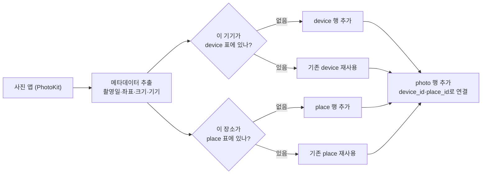
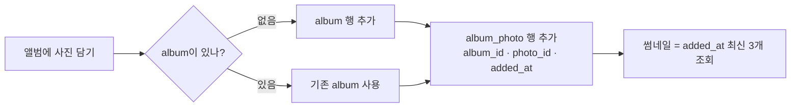
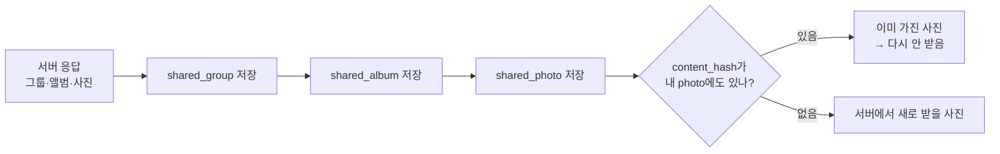
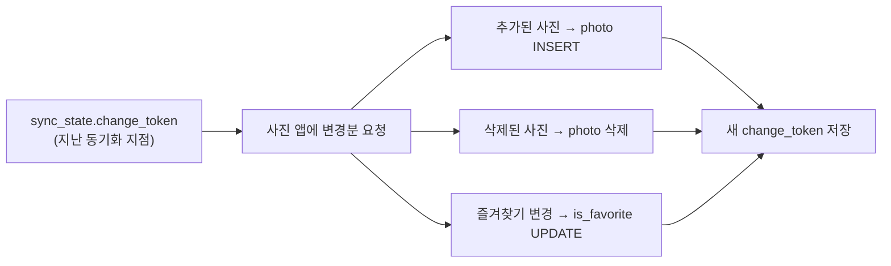
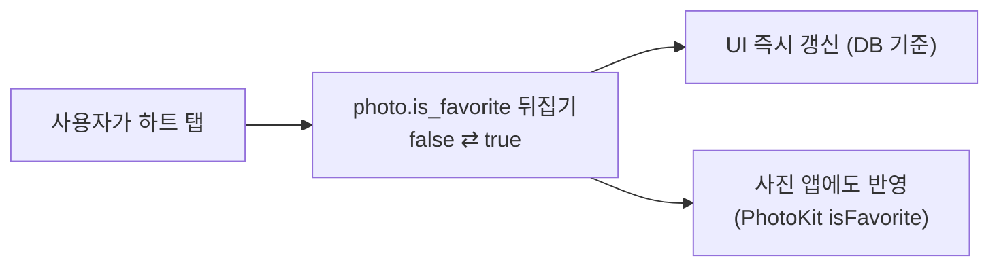
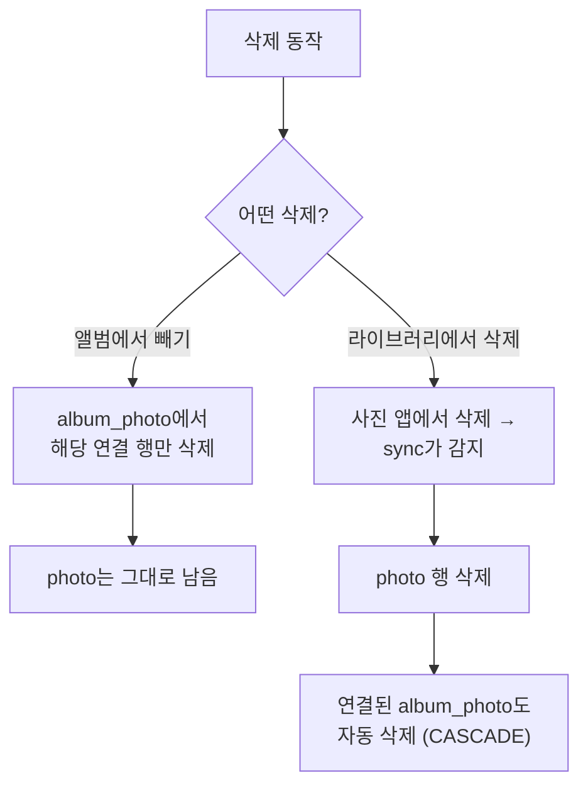
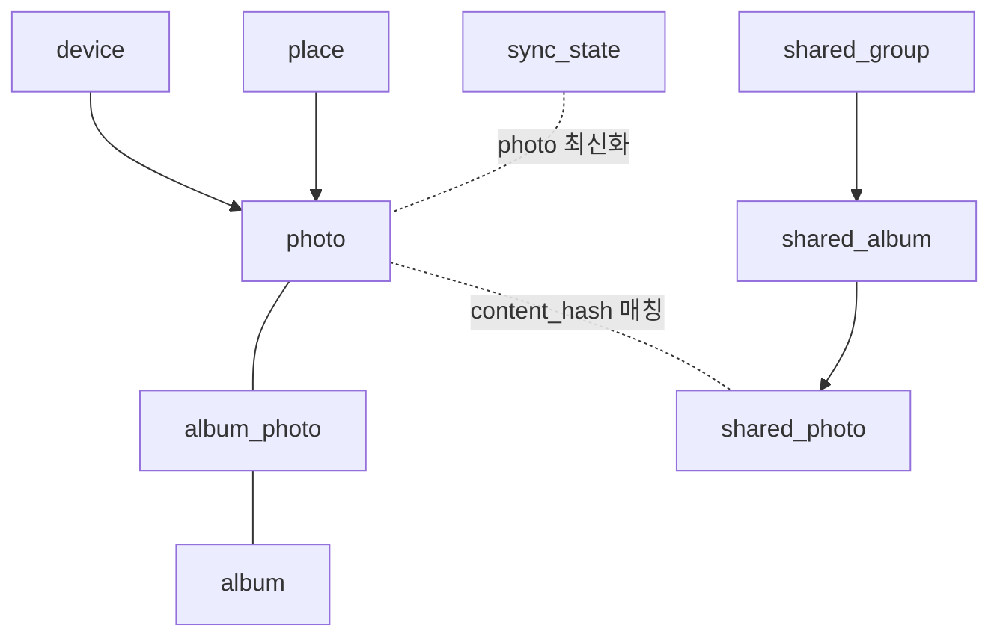

# db-data-flow

# 집집(zipzip) 로컬 DB 데이터 흐름 가이드

> **대상**: DB에 익숙하지 않은 팀원
**목표**: 데이터가 DB에 어떻게 추가·정리되는지, 실제로 어떤 표(row)가 쌓이는지 감 잡기
스키마 정의는 [`local-db-schema.md`](./local-db-schema.md), 설계 근거는 [`local-db-decisions.md`](./local-db-decisions.md) 참고.
> 

---

## 0. 30초 DB 기초 (비유)

| DB 용어 | 비유 | 설명 |
| --- | --- | --- |
| **테이블(table)** | 엑셀 시트 | 같은 종류의 데이터 묶음 (예: `photo` = 사진 목록) |
| **행(row)** | 시트의 한 줄 | 데이터 한 건 (사진 1장, 앨범 1개) |
| **열(column)** | 시트의 한 칸 종류 | 속성 (촬영일, 크기 등) |
| **PK** (기본키) | 주민번호 | 각 행을 구분하는 고유 번호 |
| **FK** (외래키) | 다른 시트를 가리키는 링크 | “이 사진의 기기 = device 시트의 1번” 처럼 연결 |

**핵심 아이디어**: 같은 정보를 여러 번 적지 않고, **한 번만 적고 번호로 연결**한다.
예) “iPhone 15 Pro”를 사진마다 쓰지 않고 `device` 표에 한 번 적은 뒤, 각 사진은 `device_id = 1`로 가리킨다.

---

## 시나리오 1. 로컬 사진의 메타데이터를 뽑아 저장

사진 앱(PhotoKit)에서 사진을 읽어 **필요한 정보만 뽑아** DB에 정리한다. 이때 기기·장소는 **중복 없이** 별도 표로 정리하고, 사진은 그걸 번호로 가리킨다.



**단계**
1. 사진 한 장을 읽어 촬영일·좌표·크기·기기 정보를 뽑는다.
2. 그 기기가 `device` 표에 없으면 새로 추가, 있으면 기존 행을 쓴다.
3. 장소도 같은 방식으로 `place` 표를 정리한다.
4. 마지막으로 `photo` 행을 추가하고, `device_id`·`place_id`로 위 두 표를 가리킨다.
(실제 사진 파일은 저장하지 않고 `local_identifier`로 참조만 한다)

### 저장 결과

**`device`** (기기 — 한 번만 저장)

| id (PK) | make | model |
| --- | --- | --- |
| 1 | Apple | iPhone 15 Pro |

**`place`** (장소 — 한 번만 저장)

| id (PK) | name | latitude | longitude |
| --- | --- | --- | --- |
| 1 | 서울 성수동 | 37.544 | 127.056 |

**`photo`** (사진 — 기기·장소를 번호로 가리킴)

| id (PK) | local_identifier | content_hash | taken_at | added_at | is_favorite | width | height | device_id (FK) | place_id (FK) |
| --- | --- | --- | --- | --- | --- | --- | --- | --- | --- |
| 101 | ABC-123 | a1b2c3 | 2026-07-01 14:30 | 2026-07-01 14:31 | false | 4032 | 3024 | **1** | **1** |
| 102 | ABC-124 | d4e5f6 | 2026-07-01 15:10 | 2026-07-01 15:11 | true | 4032 | 3024 | **1** | **1** |

> `device_id = 1` → device 표의 “iPhone 15 Pro”를 가리킨다. 사진이 늘어도 기기 이름은 device 표에 **딱 한 줄**만 있으면 된다.
> 

---

## 시나리오 2. 앨범에 사진을 담기

앨범(`album`)과 사진(`photo`)은 **다대다** 관계다 (한 앨범에 여러 사진, 한 사진이 여러 앨범에). 그래서 둘을 잇는 **연결 표** `album_photo`에 “언제 담았는지(`added_at`)”를 기록한다.



**단계**
1. 앨범이 없으면 `album` 행을 만든다.
2. 담는 사진마다 `album_photo`에 한 줄씩 추가한다: `(어느 앨범, 어느 사진, 담은 시각)`.
3. 앨범 커버 썸네일은 따로 저장하지 않고, **`added_at` 최신 3개를 그때그때 조회**해서 보여준다.

### 저장 결과

**`album`**

| id (PK) | name | created_at |
| --- | --- | --- |
| 1 | 여름 여행 | 2026-07-02 |

**`album_photo`** (앨범 ↔︎ 사진 연결)

| album_id (PK·FK) | photo_id (PK·FK) | added_at |
| --- | --- | --- |
| 1 | 101 | 2026-07-02 10:00 |
| 1 | 102 | 2026-07-02 10:01 |
| 1 | 103 | 2026-07-02 10:05 |

**썸네일 3개를 뽑는 조회(개념)**

```sql
SELECT photo_id FROM album_photo
WHERE album_id = 1
ORDER BY added_at DESC
LIMIT 3;
```

→ 결과: `103, 102, 101` (가장 최근에 담은 3장)

---

## 시나리오 3. 공유앨범 — 서버에서 받은 데이터를 로컬 DB에 저장

공유 기능은 **서버가 원본**이다. 서버가 준 그룹/앨범/사진 정보를 로컬 DB에 **그대로 복사(미러링)** 해두고, 오프라인에서도 목록을 볼 수 있게 한다. 이때 `content_hash`로 **“내가 이미 가진 사진인지”** 를 판별한다.



**단계**
1. 서버 응답을 받아 `shared_group` → `shared_album` → `shared_photo` 순서로 저장한다 (위에서 아래로 연결).
2. 각 `shared_photo`의 `content_hash`를 내 `photo` 표와 비교한다.
3. 같은 해시가 있으면 **내가 이미 가진 사진** → 다시 다운로드하지 않는다.

### 저장 결과

**`shared_group`** (공유 그룹)

| id (PK) | created_by_user_id | name | invite_code | created_at |
| --- | --- | --- | --- | --- |
| g-001 | u-777 | 가족 | XY12AB | 2026-06-20 |

**`shared_album`** (공유집 — 그룹에 소속)

| id (PK) | shared_group_id (FK) | name |
| --- | --- | --- |
| sa-100 | **g-001** | 제주 2026 |

**`shared_photo`** (공유 사진 — 공유집에 소속)

| id (PK) | shared_album_id (FK) | content_hash | original_file_name |
| --- | --- | --- | --- |
| 5001 | **sa-100** | **a1b2c3** | IMG_2026.HEIC |
| 5002 | **sa-100** | z9y8x7 | IMG_2027.HEIC |

> `5001`의 `content_hash = a1b2c3` → 시나리오 1의 내 `photo(id=101)`와 **동일**! → “이미 내 기기에 있는 사진”으로 인식해 다시 받지 않는다.
`5002`는 내게 없는 해시 → 새로 받아야 할 사진.
> 

---

## 시나리오 4. sync_state로 동기화

사진 앱의 사진은 계속 바뀐다(추가·삭제·즐겨찾기 변경). DB가 화면의 기준이므로, **바뀐 부분만 골라** DB에 반영해야 한다. 이때 “어디까지 반영했는지”를 표시하는 책갈피가 `sync_state.change_token`이다.



**단계**
1. 저장해둔 `change_token`(“지난번에 여기까지 봤음”)을 사진 앱에 건넨다.
2. 사진 앱은 그 이후 **바뀐 것만** 알려준다 (전체를 다시 훑지 않음 → 빠름).
3. 추가/삭제/수정을 각각 `photo` 표에 반영한다.
4. 마지막으로 `change_token`을 **최신 값으로 갱신**한다.

### 저장 결과 (동기화 전 → 후)

**`sync_state`**

| 시점 | id (PK) | change_token |
| --- | --- | --- |
| 동기화 전 | 1 | `token_v1` |
| 동기화 후 | 1 | `token_v2` |

**`photo` 변화 예시** — 사진 1장 추가 + 1장 즐겨찾기 해제

| id | … | is_favorite | 변화 |
| --- | --- | --- | --- |
| 101 | … | false | 그대로 |
| 102 | … | ~~true~~ → false | 즐겨찾기 해제 반영 |
| 104 | … | false | **새로 추가됨** |

> 이렇게 하면 매번 수만 장을 다시 읽지 않고, `token_v1` 이후 **바뀐 몇 장만** 처리한다.
> 

---

## 시나리오 5. 즐겨찾기 토글

하트를 누르면 그 사진의 `is_favorite` 값 **한 칸만** 바꾼다(`false ⇄ true`). DB가 화면의 기준이므로 DB를 먼저 바꿔 UI를 즉시 갱신하고, 사진 앱(PhotoKit)에도 같은 값을 반영한다.



**단계**
1. 탭한 사진의 `is_favorite` 값을 반대로 바꾼다 (`UPDATE`).
2. DB가 바뀌었으니 화면(즐겨찾기 필터·하트 아이콘)이 바로 갱신된다.
3. 사진 앱에도 같은 즐겨찾기를 반영한다. 이후 사진 앱에서 값이 또 바뀌면 **시나리오 4(동기화)** 가 DB를 최신으로 맞춘다.

### 저장 결과 (토글 전 → 후)

**`photo`** — 101번 사진의 하트를 켬

| id | … | is_favorite | 변화 |
| --- | --- | --- | --- |
| 101 | … | ~~false~~ → **true** | 즐겨찾기 켜짐 |
| 102 | … | true | 그대로 |

**즐겨찾기만 모아보는 조회(개념)**

```sql
SELECT * FROM photo WHERE is_favorite = true ORDER BY taken_at DESC;
```

---

## 시나리오 6. 사진 삭제

“삭제”는 두 가지가 있어 헷갈리기 쉽다. **① 앨범에서 빼기**(사진은 남음)와 **② 라이브러리에서 삭제**(사진 자체가 사라짐)는 다르게 동작한다.



### ① 앨범에서 빼기 — `photo`는 유지

`album_photo`의 **연결 한 줄만** 지운다. 사진 원본과 다른 앨범에서의 소속은 그대로다.

**`album_photo`** — 앨범 1에서 102번 사진만 빼기

| album_id | photo_id | added_at | 변화 |
| --- | --- | --- | --- |
| 1 | 101 | 2026-07-02 10:00 | 그대로 |
| ~~1~~ | ~~102~~ | ~~2026-07-02 10:01~~ | **삭제됨** |
| 1 | 103 | 2026-07-02 10:05 | 그대로 |

> `photo(id=102)`는 삭제되지 않는다 — 앨범에서만 빠진 것.
> 

### ② 라이브러리에서 삭제 — `photo` 삭제 + 연결 자동 정리

사진 자체를 지우면 `photo` 행이 사라진다. 이때 그 사진을 가리키던 `album_photo` 연결도 **함께 자동 삭제**된다. 이 자동 정리를 **CASCADE**(폭포처럼 따라 지워짐)라고 한다.

> 왜 필요한가? `album_photo`에 없어진 사진(102)을 가리키는 줄이 남으면, 앨범을 열 때 **깨진 링크**가 생긴다. FK에 `ON DELETE CASCADE`를 걸어두면 부모(`photo`)가 지워질 때 자식(`album_photo`)이 알아서 정리된다.
> 

**삭제 전**

| 테이블 | 데이터 |
| --- | --- |
| `photo` | 101, **102**, 103 |
| `album_photo` | (1,101), **(1,102)**, (1,103) |

**102번 사진 삭제 후**

| 테이블 | 데이터 |
| --- | --- |
| `photo` | 101, 103 |
| `album_photo` | (1,101), (1,103) — **(1,102) 자동 삭제됨** |

> `device`·`place`는 지우지 않는다(다른 사진이 아직 쓸 수 있으므로). 아무도 안 쓰는 기기·장소 정리는 필요 시 별도로 처리한다.
> 

---

## 부록. 전체 테이블 한눈에

| 구분 | 테이블 | 역할 |
| --- | --- | --- |
| 로컬 원본 | `photo` | 사진 메타데이터 (기기·장소를 번호로 참조) |
| 로컬 참조 | `device` | 기기 목록 (중복 없이 한 번만) |
| 로컬 참조 | `place` | 장소 목록 (중복 없이 한 번만) |
| 로컬 원본 | `album` | 사진집 |
| 연결 | `album_photo` | 앨범 ↔︎ 사진 (다대다), 담은 시각 기록 |
| 로컬 상태 | `sync_state` | 동기화 책갈피(`change_token`) |
| 서버 수신 | `shared_group` | 공유 그룹 |
| 서버 수신 | `shared_album` | 공유집 (그룹 소속) |
| 서버 수신 | `shared_photo` | 공유 사진 (공유집 소속), `content_hash`로 내 사진과 매칭 |

> 촬영 캘린더(날짜별 사진 유무)는 별도 표 없이 `photo.taken_at`에서 **그때그때 계산**한다.
> 

### 데이터가 서로 연결되는 큰 그림

